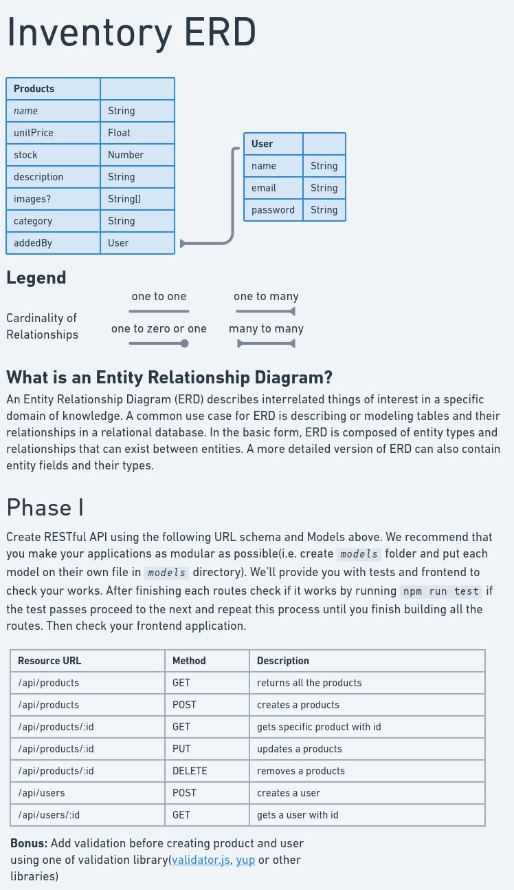

# Inventory

Its an app that enables users to keep track of products.

## Getting Started

```bash
# fork this project and clone forked repository and cd into it
npm i  # install node modules
# build the API as described in below ERD
npm run test   # test your app if it passes
npm run start
```

## ERD


